# LIVEPERSON ADAPTER

### Table of Contents
* [Description](#description)
    * [Functionalities](#functionalities)
* [LivePerson Account](#liveperson-account)
    * [Account Number](#account-number)
    * [Web Tag](#web-tag)
    * [Campaign Builder](#campaign-Builder)
* [Installation](#installation)
* [Configuration](#configuration)
* [Integration example](#integration-example)


## Description

The purpose of this adapter is to allow Inbenta customers to connect the [Inbenta's Chatbot](https://www.inbenta.com/en/products/chatbot/) to [LivePerson](https://www.liveperson.com/) and thus use the LivePerson chat platform instead of the default provided by Inbenta (HyperChat solution).
The adapter is an extension of how the chatbot works, so installation should be easy.

### Functionalities

The adapter creates and establishes a connection between the user and the LivePerson platform using the [LivePerson Web Tag](https://knowledge.liveperson.com/getting-started-add-the-liveperson-tag-to-your-website.html).

- Chat with Inbenta's Chatbot.
- Escalate to a LivePerson Agent.

> Current version has not implemented file transfer (when escalation occurs), this option will be available on next releases.

## LivePerson Account

There are some configurations you need to set and get from your LivePerson account. First, login into your account: https://authentication.liveperson.net/

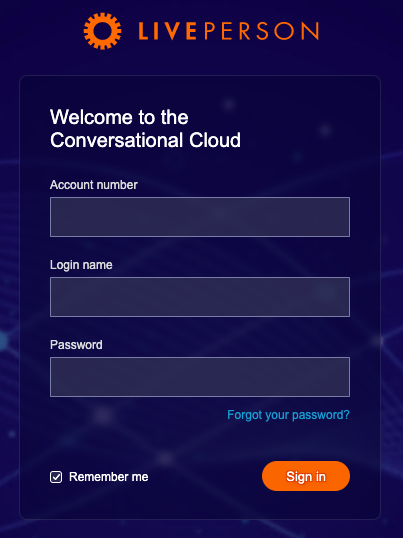

### Account Number

Once you are logged in, click on left bottom person icon, to open next window:

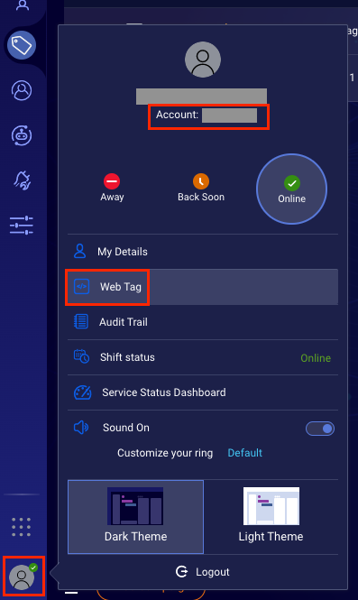

First thing you'll need from this window is the **Account Number**, save this value which will be useful in next steps.

### Web Tag

In the same opened window of the previous step, click on **Web Tag**, this will open a new view. Click on **Select** button and copy the code snippet, and paste it in the beginning of your web page (see [Configuration](#configuration) step).

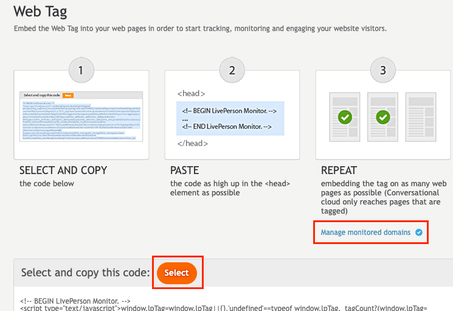

You can add a layer of security, adding your domains into a whitelist. Click on **Manage monitored domains** and then enable the whitelist option and start adding your own domains:

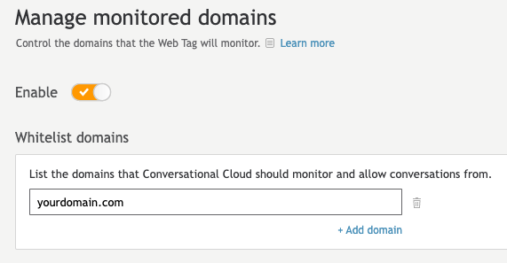

### Campaign Builder

Click on **Campaign Builder**:

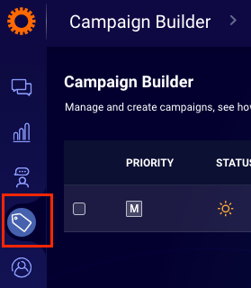

Add a new campaign, set the name, description and goal, and then add click on **Add engagement**, and select **Web** as engagement source:

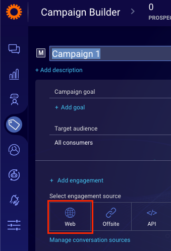

You will be guided by the steps to complete your engagement, in the first step you have to choose the design of the button (or create your own):

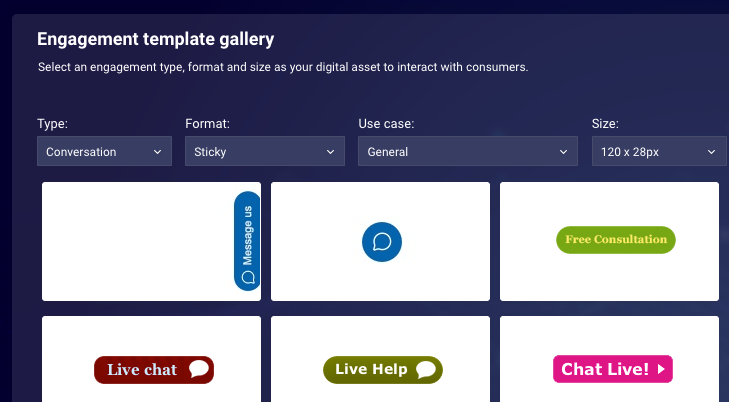

In **Engagement settings**, in _Conversation type_, choose **Live chat**:

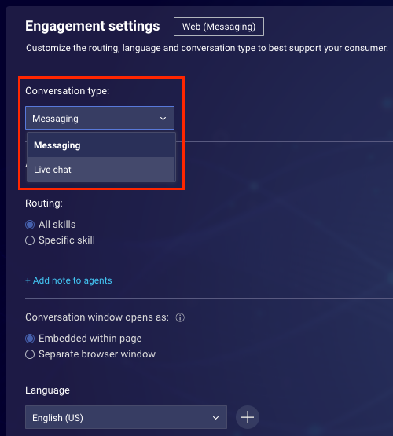

In **Engagement window library** you can select a predefined chat window or create a new one based on the existing themes:

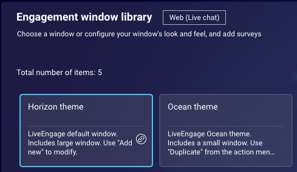

In **Entry point library** step, select **All entry points**:

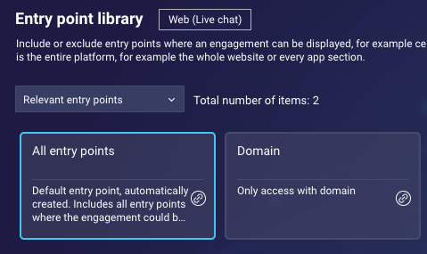

> You can add an extra layer of security allowing the access from certain domains, similar to the option in [Web Tag](#web-tag)

In **Behavioral targeting library** step, select **All behaviors**:

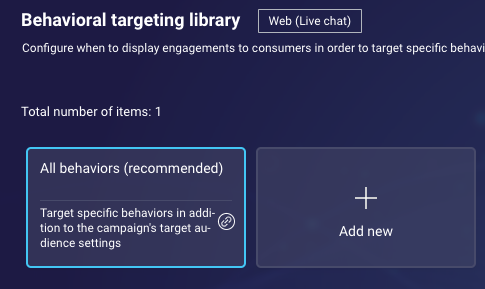

Click on **Done** button:

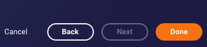

And finally **Publish**

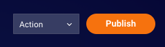

> You may need to wait several minutes for the changes to reflect.


## Installation

In order to add this adapter to your SDK, you need to import the file `/src/liveperson-adapter.js` into the HTML/JS file where you're building the SDK. Then, append it to the SDK adapters array providing the adapter configuration as shown in the [example](#integration-example) section.
Before installing it, consider the following:

* The adapter works with version **'1.62.2'** of the SDK.
* The response from escalation when there is no available agents is defined in backstage, with the content titled **'No Agents Available'**. So this content should be modified in order to show the expected message.

> Older SDK versions can still work, however the recommendation is to use at least version **1.62.2**


### Configuration

Before anything else, paste into your main html file (in the top of the ```<header>``` section) the code snippet obtained from [Web Tag](#web-tag):

```html
<header>
    ...
    <!-- BEGIN LivePerson Monitor. -->
    <script type="text/javascript">window.lpTag=window.lpTag||{},'undefined'==typeof window.lpTag._tagCount?...</script>
    <!-- END LivePerson Monitor. -->
    ...
</header>
```

This adapter expects a Javascript object with the following configuration:

This would be a valid configuration object:

```javascript
//Live Person config
let livePerson = {
  account: '<AccountNumber>',
  appKey: '721c180b09eb463d9f3191c41762bb68', //LivePerson fixed global value (do not change)
  chatUrl: localStorage.getItem('livePerson_chatUrl') == null ? '' : localStorage.getItem('livePerson_chatUrl'),
  conversationId: '',
  visitorName: '',
  labels: {
      onEscalate: 'We are processing your request, sooner you will be redirected to LivePerson chat.',
      onEscalateEnds: 'Agent conversation finished, ask me anything'
  },
  lang: 'en-US'
};
```

The backstage instance need to have the [escalationFormV2](https://developers.inbenta.io/chatbot/javascript-sdk/sdk-adapters/nl-escalation-adapter-2) available otherwise it will not work.
There is one thing to take into account also, for No-Results dialog, the content that must be redirected to in case the No-Results is the content of "EscalationStart" action.

### Integration example

In the following example we're creating a chatbot with the LivePerson adapter:

* Import the Inbenta Chatbot SDK
    ```html
    <script src="https://sdk.inbenta.io/chatbot/1.62.2/inbenta-chatbot-sdk.js"></script>
    ```
* Import the LivePerson adapter from `src/liveperson-adapter.js`
    ```html
     <script src="./src/liveperson-adapter.js"></script>
    ```
* Create a configuration object with both SDK and our custom adapter configuration. Get more information about how to get your instance credentials [here](https://help.inbenta.io/general/administration/finding-your-api-credentials/).

    ```javascript
    window.lpTag = window.lpTag || {};
    lpTag.sdes = lpTag.sdes || [];
    lpTag.events = lpTag.events || [];

    //Live Person config
    let livePerson = {
      account: '<AccountNumber>', 
      appKey: '721c180b09eb463d9f3191c41762bb68', //LivePerson fixed global value (do not change)
      chatUrl: localStorage.getItem('livePerson_chatUrl') == null ? '' : localStorage.getItem('livePerson_chatUrl'),
      conversationId: '',
      visitorName: '',
      labels: {
        onEscalate: 'We are processing your request, sooner you will be redirected to LivePerson chat.',
        onEscalateEnds: 'Agent conversation finished, ask me anything'
      },
      lang: 'en-US'
    };

    // Inbenta Chatbot SDK authentication
    // More info: https://developers.inbenta.io/chatbot/chatbot-js-sdk/sdk-setup
    let sdkAuth = {
      inbentaKey: "<YOUR_API_KEY>",
      domainKey: "<YOUR_DOMAIN_KEY>"
    }
    ```

* Add the adapter escalation and the LivePerson adapter to the SDK adapters array:

    ```javascript
    // Inbenta Chatbot SDK configuration
    // More info: https://developers.inbenta.io/chatbot/javascript-sdk/sdk-configuration
    let sdkConf = {
      chatbotId: 'liveperson_chatbot', // chatbot identification
      environment: 'development', // chatbot environment (production | development)
      closeButton: {
          visible: true
      }, // enable close button
      adapters: [
          window.SDKNLEscalation2(inbentaPromiseAgentsAvailableTrue),
          window.inbentaLivePersonAdapter()
      ]
    }
    ```

* Build the chatbot with our SDK configuration and credentials:

    ```javascript
    // Initiate Chatbot
    InbentaChatbotSDK.buildWithDomainCredentials(sdkAuth, sdkConf);
    ```
Here is the full integration code:

```html
<!DOCTYPE html>
<html>
  <head>
    <title>Inbenta LivePerson Adapter demo</title>
    <link rel="icon" href="https://www.inbenta.com/favicon.ico" type="image/x-icon">

    <!-- BEGIN LivePerson Monitor. -->
    <!-- Paste the Web Tag from your Agent Workspace (https://knowledge.liveperson.com/getting-started-add-the-liveperson-tag-to-your-website.html)-->
    <!-- END LivePerson Monitor. -->

    <!-- Import LivePerson adapter -->
    <script type="text/javascript" src="../src/liveperson-adapter.js?v=1"></script>

    <!-- Import the Inbenta Chatbot SDK (works with SDK version 1.68.2, but you can try the last one listed [here](https://developers.inbenta.io/chatbot/chatbot-js-sdk/sdk-subresource-integrity)) -->
    <script src="https://sdk.inbenta.io/chatbot/1.68.2/inbenta-chatbot-sdk.js" integrity="sha384-nZZi80wWfWj3/yG3zoDc13OnX9rMUWts5mhBMAkf2jRf7MeHvxwZj3zAqn7RCgku" crossorigin="anonymous"></script>

  </head>
  <body>
    <!-- INBENTA CHATBOT SDK-->
    <script type="text/javascript">
        window.lpTag = window.lpTag || {};
        lpTag.sdes = lpTag.sdes || [];
        lpTag.events = lpTag.events || [];

        //Live Person config
        let livePerson = {
            account: '<AccountNumber>', 
            appKey: '721c180b09eb463d9f3191c41762bb68', //LivePerson fixed global value (do not change)
            chatUrl: localStorage.getItem('livePerson_chatUrl') == null ? '' : localStorage.getItem('livePerson_chatUrl'),
            conversationId: '',
            visitorName: '',
            labels: {
                onEscalate: 'We are processing your request, sooner you will be redirected to LivePerson chat.',
                onEscalateEnds: 'Agent conversation finished, ask me anything'
            },
            lang: 'en-US'
        };

        // Inbenta Chatbot SDK authentication
        // More info: https://developers.inbenta.io/chatbot/chatbot-js-sdk/sdk-setup
        let sdkAuth = {
            inbentaKey: "<YOUR_API_KEY>",
            domainKey: "<YOUR_DOMAIN_KEY>"
        }

        // Inbenta Chatbot SDK configuration
        // More info: https://developers.inbenta.io/chatbot/javascript-sdk/sdk-configuration
        let sdkConf = {
            chatbotId: 'liveperson_chatbot', // chatbot identification
            environment: 'development', // chatbot environment (production | development)
            closeButton: {
                visible: true
            }, // enable close button
            adapters: [
                window.SDKNLEscalation2(inbentaPromiseAgentsAvailableTrue),
                window.inbentaLivePersonAdapter()
            ]
        }

        // Initiate Chatbot
        InbentaChatbotSDK.buildWithDomainCredentials(sdkAuth, sdkConf);
    </script>
  </body>
</html>
```